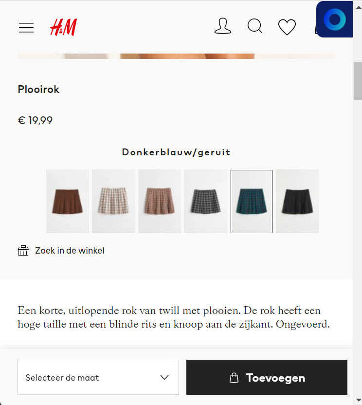

# Procesverslag
Markdown is een simpele manier om HTML te schrijven.  
Markdown cheat cheet: [Hulp bij het schrijven van Markdown](https://github.com/adam-p/markdown-here/wiki/Markdown-Cheatsheet).

Nb. De standaardstructuur en de spartaanse opmaak van de README.md zijn helemaal prima. Het gaat om de inhoud van je procesverslag. Besteedt de tijd voor pracht en praal aan je website.

Nb. Door *open* toe te voegen aan een *details* element kun je deze standaard open zetten. Fijn om dat steeds voor de relevante stuk(ken) te doen.

## Jij

  
uitwerken voor kick-off werkgroep

  ### Auteur:
  Laura Peer

  #### Je startniveau:
  Blauw/rood 

  #### Je focus:
  Mijn focus ligt bij het responsive maken (kies uit responsive óf surface plane)
 

## Je website

  
uitwerken voor kick-off werkgroep

  ### Je opdracht:
  De link naar de website die ik ga namaken is: https://www2.hm.com/nl_nl/index.html
  link naar de website die je gaat namaken óf de naam/omschrijving van je eigen ontwerp

  #### Screenshot(s) van de eerste pagina (small screen): 
  hier de naam van de pagina
  De eerste pagina die ik ga namaken is de homepagina.  
  

  #### Screenshot(s) van de tweede pagina (small screen):
  hier de naam van de pagina  
  De tweede pagina is een detailpagina. 
  https://www2.hm.com/nl_nl/productpage.1071453005.html 
  
 

## Toegankelijkheidstest 1/2 (week 1)

  
uitwerken na test in 1e werkgroep

  ### Bevindingen
  Lijst met je bevindingen die in de test naar voren kwamen:

  #### Screenreader
  Hier korte omschrijving (met indien nodig afbeeldingen)
  Bij de afbeeldingen hebben ze de naam van het kopje meegegeven zonder dat er benoemd was dat het om een afbeelding ging. Op sommige punten wordt er informatie overgeslagen.
  Het lijkt erop dsat de screen reader hier geen toegang tot heeft. De koppelingen worden goed gelezen door de screenreader. Sommige kopjes zijn als een p neergezet waardoor ze als
  een p gelezen worden. Een aantal p teksten zijn als een h3 neergezet.

  Hier een omschrijving van hoe het opgelost kan worden (met indien nodig afbeeldingen)
  Dit kan ik oplossen door alle teksten onder de juiste titel te zetten en voor de afbeeldingen in de alt tekst te benoemen dat het om een afbeelding gaat.

  #### Muis en Toetsenbord 
  Hier korte omschrijving (met indien nodig afbeeldingen)
  Met de tab toets is de website best goed te bedienen. Er is duidelijk waar je je bevind en je krijgt op alle pagina's bovenaan gelijk de optie op de navigatie over
  te slaan. Er is makkelijk heen en terug te gaan enje kan ook sneller door het menu door de tab toets ingedrukt te houden. Op de detailpagina kan je niet met de tab toets op foto's
  klikken. De webpagina heeft met de tab toets een button om het menu over te slaan. Deze optie komt op elke pagina terug. De zoekbalk is goed te bedienen en blijft niet in beeld staan
  als je hier vanaf komt. Het uitklap menu werkt niet met de tab toets. Het toevoegen aan winkelmandje is slecht te zien, je kan niet goed zien of je daar met de tabtoets staat

  Hier een omschrijving van hoe het opgelost kan worden (met indien nodig afbeeldingen)
  De button van toevoegen aan winkelwagen of een andere kleur geven of op een andere manier aangeven dat deze geselecteerd hebben. Ook kan ik zoeken naar een manier waarop de foto's
  wel worden geselecteerd.

  #### Motoriek (shocks, elastiekjes)
  Hier korte omschrijving (met indien nodig afbeeldingen)
  Als je beperkt bent, en hierdoor de muis niet goed kan bedienen dan is het wat lastig om goed op de knopjes te klikken. Het is afhankelijk hoe makkelijk of moeilijk het is van 
  het toetsenbord. Op een Mac moet je echt klikken en op een windows kan je ook klikken door je vingers op de touchpad te zetten. De windows versie is dan ook moeilijker te bedienen.

  Hier een omschrijving van hoe het opgelost kan worden (met indien nodig afbeeldingen)
  Dit kan opgelost worden door de buttons groter te maken of door de ruimte eromheen ook klikbaar te maken. Dit zal afhangen van de elementen die erom heen liggen.

  #### Visueel (brillen, contrast, kleurenblind, dark/light). 
  Hier korte omschrijving (met indien nodig afbeeldingen)
  De licht grijze kleine tekst is slecht te lezen voor iemand met slecht zicht. De foto's zijn dan nog wel te bekijken. Als er geen rood te zien is valt het best mee, de website
  blijft herkenbaar. Bij de details is te zien om welke kleur het gaat. Ze hebben schriftelijk beschreven om welke kleur het gaat. Als je alles roze ziet komen de rode kleuren meer
  tot zijn recht. Er is benoemd om welke kleur het gaat dus dat probleem wordt verholpen. In zwart/wit moet er duidelijker zijn waar je wel en niet op kan klikken. Doordat je geen
  kleur ziet is het lastig te zien wat de active state en de hover state is. 
  Als je een bepaalde beperking heb aan je ogen is het soms lastig om naar het vel witte scherm te kijken. Hiervoor zou een darkstate goed kunnen werken. Ook kan het nodig zijn om 
  maar 1 stuk informatie per keer te laten zien. Soms kunnen de verschillende informatie over elkaar heen gaan lopen en dan wordt het voor deze mensen lastig om te lezen.

  Hier een omschrijving van hoe het opgelost kan worden (met indien nodig afbeeldingen)
  Ik kan meer contrast toevoegen tussen de voor en de achtergrond. En de p teksten groter in lettertype en een duidelijkere kleur. Ook zou ik in de naam van het product de kleur
  kunnen verwerken.

## Breakdownschets (week 1)

  
uitwerken na afloop 2e werkgroep

  ### de hele pagina: 
  

  ### dynamisch deel (bijv menu): 
  

  ### wellicht nog een dynamisch deel (bijv filter): 
  

## Voortgang 1 (week 2)

  
uitwerken voor 1e voortgang

  ### Stand van zaken
  hier dit ging goed & dit was lastig (neem ook screenshots op van delen van je website en code)
  Het schrijven van de html ging best voorspoedig. Eenmaal de css ervoor schrijven vind ik lastig. Dan merk ik toch dat ik heel veel met classes en id's gedaan heb en dit weer even wennen is. Ik heb op het moment voornamelijk nog moeite met iets selecteren. 
    

  ### Agenda voor meeting
  Als groepje hebben we besproken dat we de volgende punten willen bespreken:

  | student 1                                               | student 2                 | student 3                 | student 4                 |
  | Ik wil graag het nog hebben over elementen selecteren.  | Nog geen aandachtspunten. | Nog geen aandachtspunten. | Nog geen aandachtspunten. |
  | dit bespreken. en dat ook nog                           | en dit                    | en ik dit                 | en dan ik dat             |
  | Als er tijd over is zou ik graag nog wat willen weten   | dit als er tijd is        | nog een punt              | dit wil ik zeker          |
  | over hoe je met grid elementen entreert.                | ...                       | ...                       | ...                       |

  ### Verslag van meeting
  Tijdens het feedback moment met de studentassistenten hebben we:
  - We hebben gekeken naar de opbouw van de html. En of deze semantisch correct was.
  - Ook hebben we gekeken naar het eerste stuk van onze css en heb aanroepen van selectoren.

## Voortgang 2 (week 3)

  
uitwerken voor 2e voortgang

  ### Stand van zaken
Ik heb deze week best wat moeten doen om een beetje op schema te komen. Ik heb veel gedaan met het juist neerzetten van de elementen, dus dat ze binnen het scherm blijven en heb gekeken naar welke iconen en states ik nog moet toevoegen. Ik heb in het begin best wel even gestruggled met de elementen binnen het scherm houden maar met wat hulp en later goed doorkijken wat er nou gebeurd is heb ik het uiteindelijk gebrepen en verder kunnen toepassen bij andere delen van de site.

Verder heb ik gekeken naar wat ik nou wil gaan doen, responsive of bling bling. Ik heb gekeken naar wat ik kan doen met animatie maar hier kwam ik niet helemaal uit. 

  ### Agenda voor meeting
  We hebben gezamenlijk besproken dat we het volgende graag nog even willen bespreken:          

  | Laura      | Idelene         | Mohini  | Shanine     | Shani |
  | ---            | ---                | ---          | ---              | --- |
  | Animatie | Positionering    | Responsiveness en de @media tag            | Wanneer wel classes    |  pseudo elementen  |
  | En hoe het zit met de 2e pagina.  | Alt labels  | Stijlen van forms | Element dat vershuift als je scrolt |
  | ...            | ...                | En het hamburgermenu      | ...              |

  ### Verslag van meeting
  hier na afloop snel de uitkomsten van de meeting vastleggen

  - punt 1
  - punt 2
  - nog een punt
- ...

## Toegankelijkheidstest 2/2 (week 4)

  
uitwerken na test in 8e werkgroep

  ### Bevindingen
  Lijst met je bevindingen die in de test naar voren kwamen (geef ook aan wat er verbeterd is):

  #### Screenreader
  Hier korte omschrijving (met indien nodig afbeeldingen)

  Hier een omschrijving van hoe het opgelost kan worden (met indien nodig afbeeldingen)

  #### Muis en Toetsenbord 
  Hier korte omschrijving (met indien nodig afbeeldingen)

  Hier een omschrijving van hoe het opgelost kan worden (met indien nodig afbeeldingen)

  #### Motoriek (shocks, elastiekjes)
  Hier korte omschrijving (met indien nodig afbeeldingen)

  Hier een omschrijving van hoe het opgelost kan worden (met indien nodig afbeeldingen)

  #### Visueel (brillen, contrast, kleurenblind, dark/light). 
  Hier korte omschrijving (met indien nodig afbeeldingen)

  Hier een omschrijving van hoe het opgelost kan worden (met indien nodig afbeeldingen)

## Voortgang 3 (week 4)

  
uitwerken voor 3e voortgang

  ### Stand van zaken
  hier dit ging goed & dit was lastig (neem ook screenshots op van delen van je website en code)

  ### Agenda voor meeting
  samen met je groepje opstellen

  | student 1      | student 2          | student 3    | student 4        |
  | ---            | ---                | ---          | ---              |
  | dit bespreken  | en dit             | en ik dit    | en dan ik dat    |
  | en dat ook nog | dit als er tijd is | nog een punt | dit wil ik zeker |
  | ...            | ...                | ...          | ...              |

  ### Verslag van meeting
  hier na afloop snel de uitkomsten van de meeting vastleggen

  - punt 1
  - punt 2
  - nog een punt
  - ...

## Eindgesprek (week 5)

  
uitwerken voor eindgesprek

  ### Je uitkomst - karakteristiek screenshots:
  

  ### Dit ging goed/Heb ik geleerd: 
  Korte omschrijving met plaatjes

  

  ### Dit was lastig/Is niet gelukt:
  Korte omschrijving met plaatjes

  

## Bronnenlijst

  
continu bijhouden terwijl je werkt

  Nb. Wees specifiek ('css-tricks' als bron is bijv. niet specifiek genoeg).

  1. bron 1
  2. bron 2
  3. ...

